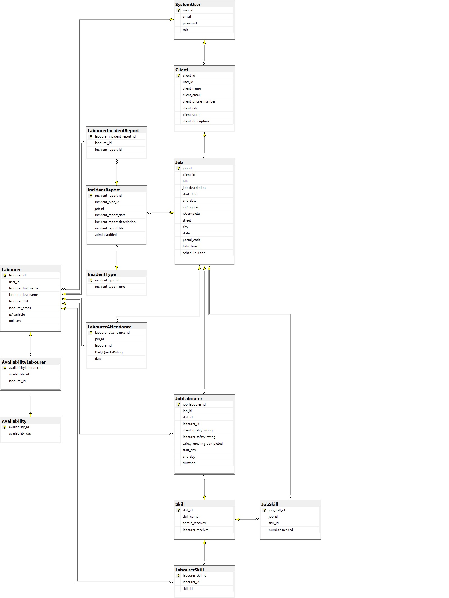

# Labour Recruitment Platform
This app provides a platform where clients and labourers can handle the entire process from labourer application to confirmation of
completed work online in a collected format.

## Functional Requirements
See all requirements [here](https://github.com/mingwang168/Labour-Recruitment/wiki/Functional-Requirements-List).

## Tech Stack
* React Frontend
* ASP.NET Backend
* SendGrid for emails

## Wireframes/Mockups
Wireframes and mockups are hosted on Figma [here](https://www.figma.com/file/uSwmbKRANUn3rPjZvSqXrd/Labourer-Recruitment-App?node-id=39%3A87).

## ERD

## Use Case Diagram

##  Installation instruction
To run the front-end:
Unzip the zip file into an empty directory.
In Labour-Recruitment\client folder, run the commands: 
>npm install
>npm start
